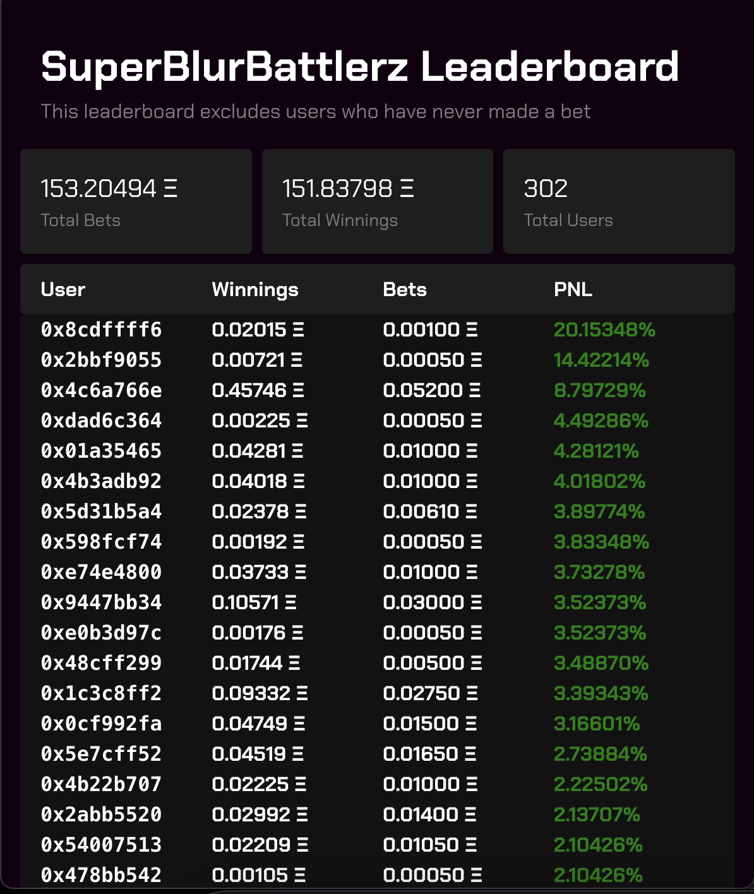

# GhostGraph Interface Template

## Overview

[GhostGraph](GhostGraph.xyz) enables smart contract developers to create indexers in Solidity, which are queryable via
GraphQL. These indexers typically support the data needs of decentralized applications (dApps).

This repository demonstrates the process using SuperBlurBattlerz, a protocol within the Blast ecosystem, to construct a
user leaderboard.

## Getting Started (without using your graph)

1. Clone the repository: `git clone <this repo url>`
2. Install dependencies: `npm install`
3. Copy the example environment variables: `cp .env.example .env`
4. Start the application: `npm run start`

### You should see a leaderboard resembling this:

## Integrating Your GhostGraph

1. Follow the steps under 'Getting Started.'
2. Replace the GhostGraph Query URL in the .env file with your own (available in GhostGraph's code editor after deploying your indexer).
3. Add custom queries to your queries.graphql file.
4. Generate TypeScript types and React hooks: `npm run codegen`
5. Start the application: `npm run start`

## No GhostGraph Account?

Interested in becoming an alpha tester? Sign up [here](https://app.ghostlogs.xyz/ghostgraph/sign-up)

## Questions

Connect with us on [Telegram](https://t.me/ghostlogsxyz) 